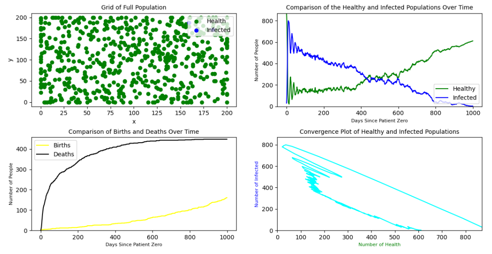
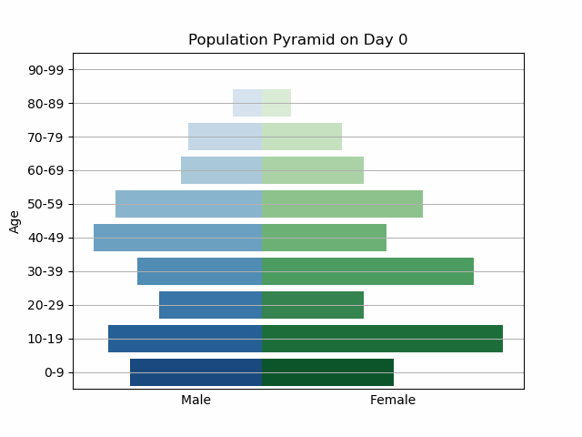

# Agent Based Modelling Assignment
> Define and implement an Agent Based Model of a virus spread among a group or between groups of people

## Recommended Steps:

1. Download the Repository
2. Download the [PyCX GUI](https://math.libretexts.org/Bookshelves/Scientific_Computing_Simulations_and_Modeling/Book%3A_Introduction_to_the_Modeling_and_Analysis_of_Complex_Systems_(Sayama)/10%3A_Interactive_Simulations_of_Complex_Systems/10.02%3A_Interactive_Simulation_with_PyCX)
3. Run the following command in the code directory:
>       python model.py
4. You can run the simulation and perform experiments using the interface window.

If you face issues running the code, please consult the original document: [PyCX](https://github.com/hsayama/PyCX/blob/master/README.md)

## Project Insights
- We controlled and observed the impact of population density on a virus outbreak.
- A virus spreads through high-density populations more rapidly than low-density populations.
- The introduction of vaccinations after a year (Day 365) managed to eradicate the virus before it became out of control.
- This is observed in the two simulation runs shown below:

### High Population Density Outbreak


### Low Population Density Outbreak


## Project Highlights
- To simulate a "realistic" scenario we analyzed real data based on the Irish population this includes (code: code/initial_population_stats.py, output: data/person_probabilities.json):
   1. Irish sex distribution (Probability of being female/male).
   2. Irish age distribution (Probability of being a certain age).
   3. Irish female fertility rate by age.
   4. Irish covid mortality rate by age.
   5. Vaccination rates by age including 1 booster as a time-series (**Isn't implemented into the ABM**)
- code/Person.py script is used to randomly generate a person
   1. This randomly assigns the following features:
      1. Age
      2. Sex
   2. Assigns based on age:
      1. Covid mortality rate
      2. Fertility Rate (If female)
- code/Person.py script can also generate a newborn if a female give birth.
   1. There is a 50/50 chance of the newborn being female/male.
   2. 100% chance of being 0 years old and having a mortality and fertility rate of 0.
- Agent-Based Model is simulated in the code/model.py script, this includes the following:
   1. **initialize**:
      - This function is responsible for setting up the initial state of the agent-based model.
      - It initializes global variables like `time`, `population`, `infected`, and various data arrays (`hdata`, `idata`, `bdata`, `ddata`, `new_deaths`) that will store information about the simulation over time.
      - It generates a population of agents (people) and assigns them random initial positions on a grid.
      - Each agent is randomly assigned an infection status (infected or healthy) based on the `initial_covidrate`.
      - If the `save_model_data` flag is set, it also creates a directory for saving simulation data.
      - Finally, it calls the `create_files` function to create data files if saving is enabled.
   
   2. **observe**:
      - The `observe` function is responsible for visualizing the current state of the simulation.
      - It uses Matplotlib to create four subplots:
        1. A scatterplot of the population, showing healthy agents in green and infected agents in blue.
        2. A time-series plot showing the number of healthy and infected agents over time.
        3. A time-series plot showing the cumulative number of births and deaths over time.
        4. A plot showing the convergence of healthy and infected populations.
      - It updates these plots based on the current state of the simulation's `population` and the data arrays.
      - If the `save_model_data` flag is set, it also calls the `save_files` function to save simulation data.
   
   3. **update**:
      - The `update` function advances the simulation by one time step.
      - It updates the `time` variable and initializes empty lists (`new_deaths` and `newly_infected`) to keep track of new events.
      - It simulates random movement for each agent on the grid by adding random noise to their positions.
      - If an agent is infected, it checks whether they spread the infection to nearby agents based on the `catching_covid_probability`.
      - It also checks if infected agents have a chance of dying based on their mortality rates.
      - If agents are healthy, there is a chance they may give birth based on fertility rates by age.
      - It checks if agents become vaccinated based on the specified vaccination timeline.
      - The function updates various data arrays (`hdata`, `idata`, `bdata`, `ddata`) and dictionaries (`new_deaths`, `death_dict`) to record simulation outcomes.
      - Finally, it calls the `update_agent` function to make necessary updates to the agents' attributes based on the simulation events.
   
   These functions collectively define the core logic of the agent-based model, including initialization, observation, and the simulation step.
---
### Population Pyramid 
The visual observes the age of the population across one simulation run. In this simulation, the virus wipes out the older population. However, the new borns are not affected by the virus.



## Model Requirements
You can use an Agent based simulator, written in Python and covered during lectures, as a basis of your model (https://github.com/hsayama/PyCX), but you are also free to implement your own programme, in a programming language of choice. The only restrictions is that you cannot use any of the existing ABM frameworks listed in lecture materials and also here e.g. https://github.com/hsayama/PyCX

Your model needs to satisfy the following properties:
- [x] A clear documentation outlining the model, its purpose and rules (how) and reasons (why) for underlying agent behaviour, as well as the intended output results of the simulation and the reason for tracking those. Tracking several output results is preferable. The documentation should also report results of running the model under several parameter scenarios and the observed outcomes.
- [x] The code of the model should be well-structured and documented.
- [x] The model should have an easy to run command-line or GUI that allows for changing the initial values of simulation parameters (the more parameters investigated the better, within reason).
- [x] The model must have a graphical display (2D or 3D) that allows for visual simulation of agent behaviour over time.
- [x] The model must have the ability to output results as time-based graphs (e.g. number of infected people over time or average vehicle speed over time, etc.).
- [x] Your documentation should be professional, self-contained i.e. contain all the relevant information and outputs and it should not exceed 8 pages in total (any code can be uploaded on GitLab).
- [x] Your final submission should contain report with all the details outlined above, link to the code and readme file explaining how to run the simulation.
---
## Project Directory Structure
```
./
├── .git
├── .gitignore
└── code
|    ├── initial_population_statistics.py
|    ├── Person.py
|    ├── model.py
|    ├── utils.py
|    └── ETC
└── Data
    ├── CSO_birthRate_2020.csv
    ├── CSO_census_2016.csv
    ├── CSO_vaccinationRate_2021_2023.csv
    ├── HSPC_covidDeath_2020_2023.csv
    ├── initial_population_characteristics.json
    └── vaccination_stats.csv
└── deliverables
    └── Final Report.pdf
```
 
 Data can be found through the links below:
 1. [CSO 2020 Birth Data](https://data.cso.ie/table/VSA36)
 2. [CSO 2016 Census Data](https://data.cso.ie/table/E3001)
 3. [CSO 2021-2023 Vaccination Data](https://data.cso.ie/table/E3001)
 4. [HSPC 2020-2023 Covid Data](https://www.hpsc.ie/a-z/respiratory/coronavirus/novelcoronavirus/surveillance/covid-19deathsreportedinireland/COVID-19_Death_Report_Website_v1.8_06032023.pdf)
 
